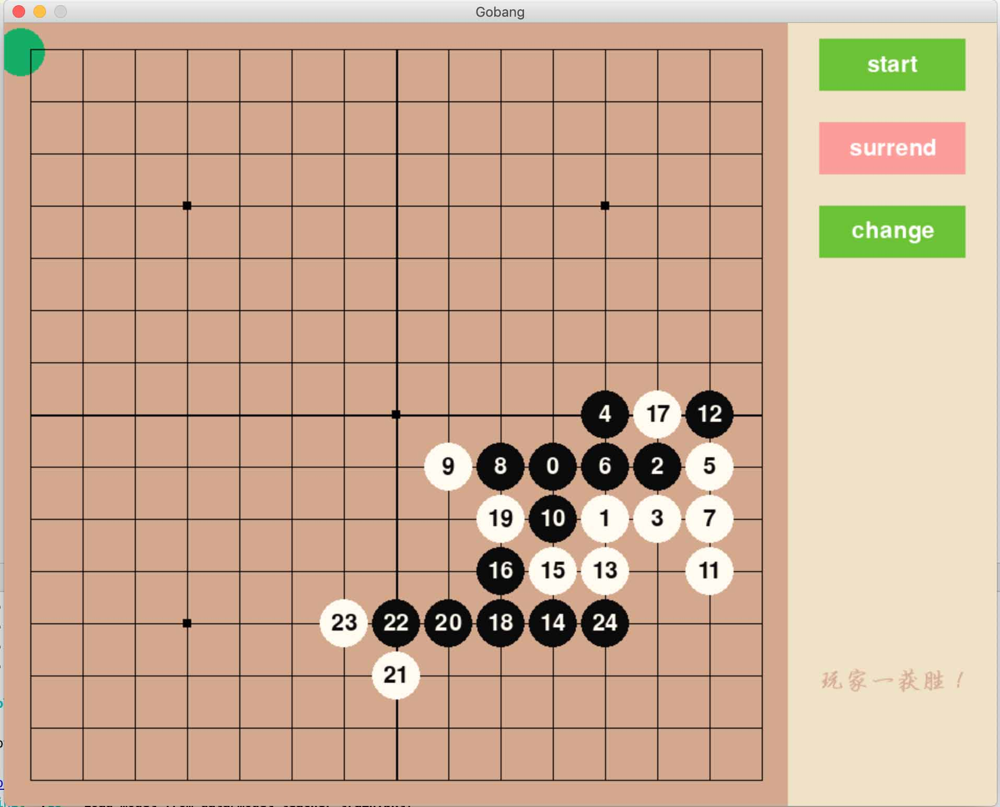

# GoBang with Transformer

****************

## Introduction

用Transformer(基于pytorch实现)下五子棋，训练的时候使用另一个剪枝算法和Transformer进行对战，期间Transformer的胜率由4%上升至60%以上。训练当前仅支持cpu(支持多进程训练)，从零训练1万盘对局接近收敛，可下载训练好的权重进行尝试.

<div align="center">
  
</div>

****************

## Requirements

Python version: >=Python3.8
Packages:
- torch >=1.9.0
- pygame >= 2.0.1

安装依赖:
```bashrc
$ pip install -r requirements.txt
```

****************

## Quick Start

将模型权重文件下载后，命名为“model_teacher_train.pkl”，放置在data文件夹下。

#### 进行人机对战:
```bashrc
$ python tools/player_with_ai.py
```
人机对战时，若AI输了当局，模型权重会进行更新

#### 训练模型:
```bashrc
$ python tools/train.py
```
若有权重文件，则可以加载权重文件后继续学习，若权重文件不存在，则使用默认初始化参数进行训练
****************


## More Details

- 算法实现细节，参见博客（我还没写，比较懒，麻烦等等吧） [Description and discussion](https://zhuanlan.zhihu.com/p/106586069)